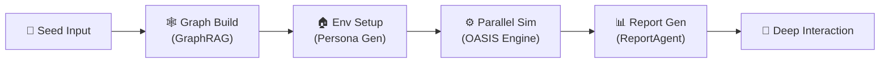

<div align="center">


# MiroFish-EN

**English fork of [MiroFish-Local](https://github.com/tt-a1i/MiroFish-local) — fully local deployment with Graphiti + Neo4j. Your data stays on your machine.**

*Multi-agent swarm intelligence simulation engine for predicting public opinion, market sentiment, and social dynamics. Runs entirely on-premises.*

[](https://github.com/loserbcc/MiroFish-EN/stargazers)
[](https://github.com/loserbcc/MiroFish-EN/network)
[](https://github.com/loserbcc/MiroFish-EN/blob/main/LICENSE)
[](https://www.docker.com/)

</div>

## What Is This?

[MiroFish](https://github.com/666ghj/MiroFish) is an AI prediction engine powered by multi-agent technology — it builds high-fidelity parallel digital worlds for swarm intelligence simulation. The original relies entirely on **Zep Cloud** for memory and knowledge graphs, meaning data leaves your network.

**MiroFish-EN** is a fully English fork based on [MiroFish-Local](https://github.com/tt-a1i/MiroFish-local), which adds a **Graphiti + Neo4j local mode** so you can run the entire simulation pipeline without any cloud memory service. Cloud mode is still available — switch with a single environment variable.

### Differences from Original MiroFish

| Feature | Original MiroFish | MiroFish-EN |
|---------|:-----------------:|:-----------:|
| Language | Chinese | **English** |
| Memory / Knowledge Graph | Zep Cloud (remote) | **Graphiti + Neo4j (local)** or Zep Cloud |
| Cloud Dependency | Requires Zep Cloud API | **Optional: supports Cloud and local modes** |
| Data Privacy | Data passes through 3rd-party cloud | **Local mode keeps data on-premises** |
| Entity Extraction | Zep Cloud built-in | **Local LLM extraction (via Graphiti)** |
| Deployment | Requires Zep Cloud account | **Docker Compose one-click Neo4j startup** |
| Mode Switching | None | **`ZEP_BACKEND=cloud|graphiti` toggle** |

> **TL;DR**: If you want your data to stay local, need to run offline, or just want MiroFish in English — this is your version.

## 3-Minute Quick Start

```bash
git clone https://github.com/loserbcc/MiroFish-EN.git
cd MiroFish-EN
cp .env.example .env           # Edit .env, add your LLM_API_KEY
npm run setup:all              # Install dependencies
npm run backend &              # Start backend
python demo.py                 # Run the demo!
```

The demo script uploads a [sample news article](./examples/seed_news.txt), extracts entities and relationships via LLM, and builds a knowledge graph — letting you see MiroFish's core capabilities in action.

## Architecture



| Module | Description |
|--------|-------------|
| **Seed Input** | Upload seed materials (news, reports, stories), define prediction requirements |
| **Graph Build** | Extract entity relationships via GraphRAG, inject individual and collective memory, build knowledge graph. Local mode uses Graphiti + Neo4j instead of Zep Cloud |
| **Env Setup** | Auto-generate agent personas, inject simulation parameters via config agent |
| **Parallel Sim** | OASIS engine drives large-scale agent interactions, dynamically updates temporal memory |
| **Report Gen** | ReportAgent uses rich toolset for deep interaction with post-simulation environment, generates prediction reports |
| **Deep Interaction** | Chat with any agent in the simulated world, or explore further with ReportAgent |

## Workflow

1. **Graph Build** — Seed extraction & individual/collective memory injection & GraphRAG construction. Extracts key entities and relationships from uploaded seed materials to build the structured knowledge graph.

2. **Environment Setup** — Entity relationship extraction & persona generation & simulation parameter injection. Auto-generates agents with independent personalities and backstories, configures social network topology.

3. **Simulation** — Dual-platform parallel simulation & auto-parse prediction requirements & dynamic temporal memory updates. OASIS engine drives agents to freely interact, recording behavioral trajectories and attitude changes.

4. **Report Generation** — ReportAgent with rich toolset for deep interaction with the post-simulation environment. Aggregates simulation data, analyzes group behavior patterns from multiple dimensions, outputs structured prediction reports.

5. **Deep Interaction** — Chat with any agent in the simulated world & interact with ReportAgent. Users can intervene at any time to explore evolution paths under different decisions.

## Use Cases

| Scenario | Description |
|----------|-------------|
| 🗞️ **Public Opinion Prediction & Crisis PR** | Simulate how breaking news spreads on social networks, predict opinion trajectories, prepare response plans |
| 💹 **Financial Market Sentiment** | Model investor group behavior, simulate market reactions to policy and events, inform investment decisions |
| 🏛️ **Policy Impact Assessment** | Preview policy effects in a virtual society, observe behavioral feedback across different groups |
| ✍️ **Creative Experiments** | Novel ending prediction, historical event replay, thought experiments — let imagination run in a digital world |
| 🔬 **Social Science Research** | Large-scale controllable experiment platform for sociology, communications, behavioral economics |

## Quick Start

### Prerequisites

> Note: MiroFish was developed and tested on Mac/Linux. Windows compatibility is untested.

| Tool | Version | Description | Check |
|------|---------|-------------|-------|
| **Python** | 3.11+ | Backend runtime | `python --version` |
| **Node.js** | 18+ | Frontend runtime (includes npm) | `node -v` |
| **uv** | Latest | Python package manager | `uv --version` |
| **Docker** *(optional)* | Latest | Local mode: runs Neo4j | `docker --version` |

### 1. Configure Environment Variables

```bash
cp .env.example .env
# Edit .env and fill in required API keys
```

#### LLM API Configuration (required)

Supports any LLM with OpenAI SDK format. Works with z.ai (GLM), Google Gemini, DashScope (Qwen), OpenAI, and more.

> Note: Simulations are resource-intensive. Start with fewer than 40 rounds to test.

```env
LLM_API_KEY=your_api_key
LLM_BASE_URL=https://open.bigmodel.cn/api/paas/v4
LLM_MODEL_NAME=glm-4-plus
```

#### Zep Backend Selection

Switch memory backend via `ZEP_BACKEND`:

| Value | Mode | Description |
|-------|------|-------------|
| `cloud` | Zep Cloud (default) | Zero config, free tier available |
| `graphiti` | Local Graphiti + Neo4j | Fully local, data stays on-premises |

#### Graphiti / Neo4j Local Config (required when `ZEP_BACKEND=graphiti`)

```env
NEO4J_URI=bolt://localhost:7687
NEO4J_USER=neo4j
NEO4J_PASSWORD=password
GRAPHITI_LLM_MODEL=glm-4-plus
GRAPHITI_EMBEDDING_MODEL=text-embedding-v4
```

### 2. Start Dependencies (optional, local mode only)

```bash
docker-compose -f docker-compose.local.yml up -d
docker-compose -f docker-compose.local.yml ps
# Neo4j Browser: http://localhost:7474 (user: neo4j, password: password)
```

### 3. Install Dependencies

```bash
npm run setup:all
```

### 4. Start Services

```bash
npm run dev
```

**Service URLs:**
- Frontend: `http://localhost:3000`
- Backend API: `http://localhost:5001`

## Hardware Requirements

MiroFish is an LLM-calling application — compute happens on the LLM API side, local resource needs are low.

| Config | CPU | RAM | Disk | GPU |
|--------|-----|-----|------|-----|
| **Minimum** | 4 cores | 8 GB | 10 GB | Not needed |
| **Recommended** | 8 cores | 16 GB | 20 GB | Not needed |

> GPU only needed if running a local LLM (e.g., via Ollama). Cloud LLM APIs need no GPU.

## FAQ

<details>
<summary><b>What's the difference between Cloud and Local mode?</b></summary>

Cloud mode uses Zep Cloud to store memory and knowledge graphs — simple to configure but data passes through the cloud. Local mode uses Graphiti + Neo4j, keeping all data on-premises. Switch via the `ZEP_BACKEND` environment variable.
</details>

<details>
<summary><b>Neo4j won't start?</b></summary>

1. Confirm Docker is installed and running: `docker --version`
2. Check if ports 7474/7687 are in use: `lsof -i :7474`
3. View container logs: `docker-compose -f docker-compose.local.yml logs neo4j`
4. Try clean restart: `docker-compose -f docker-compose.local.yml down -v && docker-compose -f docker-compose.local.yml up -d`
</details>

<details>
<summary><b>Which LLMs are supported?</b></summary>

Any LLM API compatible with the OpenAI SDK format, including: z.ai (GLM-4), Google Gemini, DashScope (Qwen-plus/Qwen-max), OpenAI (GPT-4o), DeepSeek, local Ollama, and more. Just configure `LLM_BASE_URL` and `LLM_API_KEY`.
</details>

<details>
<summary><b>How many tokens does one simulation use?</b></summary>

Depends on agent count and simulation rounds. Recommend starting with fewer than 40 rounds — expect ~500K-1M tokens.
</details>

## Contributing

Pull requests and issues welcome! See [CONTRIBUTING.md](./CONTRIBUTING.md).

## Acknowledgments

**This project is a fork of [MiroFish-Local](https://github.com/tt-a1i/MiroFish-local), which is itself a fork of [MiroFish](https://github.com/666ghj/MiroFish).**

Thanks to [666ghj/MiroFish](https://github.com/666ghj/MiroFish) and Shanda Group for the original open-source project. MiroFish's simulation engine is powered by **[OASIS](https://github.com/camel-ai/oasis)**, a high-performance social media simulation framework by [CAMEL-AI](https://github.com/camel-ai) supporting million-scale agent interactions.

**This fork adds:**
- Full English translation of all prompts, UI, and documentation
- Graphiti + Neo4j local memory backend (replacing Zep Cloud dependency)
- `ZEP_BACKEND` environment variable for `cloud` / `graphiti` mode switching
- Docker Compose config for one-click Neo4j 5.26 + APOC startup
- Automatic LLM config mapping to Graphiti
- Search reranking fallback (non-standard APIs auto-switch to RRF reranking)
